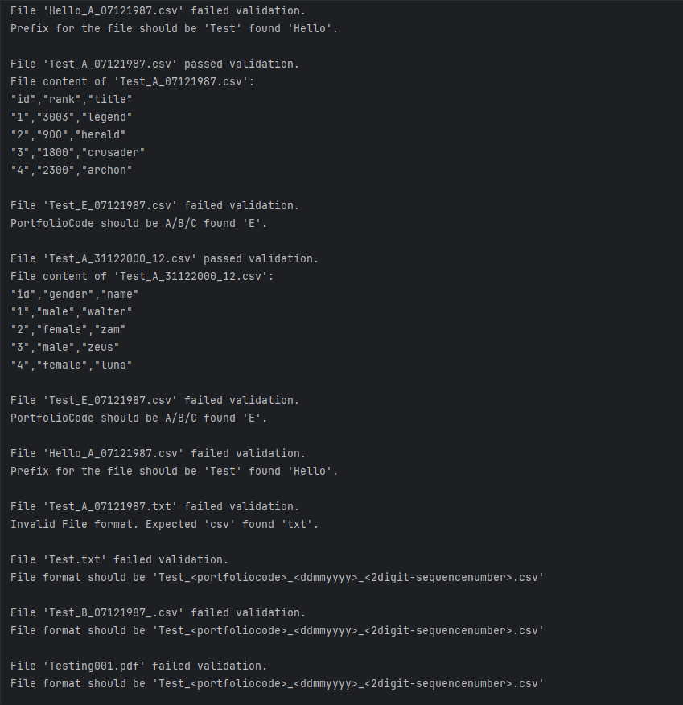
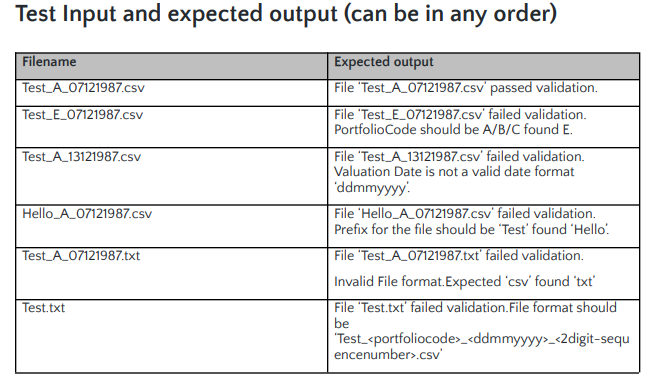

# file name validator utility
This is a simple Java-based file validation utility that checks the structure of filenames based on specific rules, reads their content (if valid), and prints messages accordingly.

## To download the application
Git clone will allows you to download the whole source code of the application. Use this command in your bash/terminal

```bash

  git clone https://github.com/edneilcabigao444/file-name-validator.git

```
# Project Structure [Standalone Java Application]
```yaml 
file-name-validator

src
  - com.jp.file.validator
      - constants
         - CommonConstant.java
      - service
         - FileNameValidatorImpl.java
         - ReadFileImpl.java
      - util
         - CommonUtil.java
     Main.java

test
  - com.jp.file.validator
      - service
         - FileNameValidatorImplTest.java
         - ReadFileImplTest.java
      - util
         - CommonUtilTest.java
     MainTest.java

resources
 - Hello_A_07121987.csv
 - Test.txt
 - Test_A_07121987.csv
 - Test_A_07121987.txt
 - Test_A_31122000_12.csv
 - Test_E_07121987.csv
 - Testing001.pdf [Other type of file]

pom.xml
```


## File Naming Convention

The expected format for filenames is:

- **Prefix**: Must start with `Test`
- **Portfolio Code**: Must be one of `A`, `B`, or `C`
- **Date**: Must be a valid date in `ddMMyyyy` format
- **Sequence**: Optional, but if present, must be a 2-digit number with sequential digits (like `12` or `21`)
- **Extension**: Must be `.csv`

### Additional Enhancement of Code
- Add **Error handling** if the file is not exist in the **resource** folder
- Add **Error handling** if the the sequence number is not valid or not found

## Unit Testing Coverage

### Dependencies used for testing
- Junit Jupiter
    - 5.10.0
      > JUnit Jupiter is the combination of the new programming model and extension model for writing tests and extensions in JUnit 5
- Mokito
    - 5.12.0
      > Mockito is an open-source Java mocking framework used for creating test double objects in unit tests
- Maven Surefire Plugin
    - 3.2.1
      > The Surefire Plugin is used during the test phase of the build lifecycle to execute the unit tests of an application. It generates reports in two different file formats:
      - Plain text files (*.txt)
      - XML files (*.xml)


# How to Run

### TechStack 
- Java 11 
- Maven
- JUnit 5
- Mockito

### Prerequisites

- Java 11 or later
- Maven (for building and running tests)

### Run the Program

```bash

# Navigate to the project root
cd your-project-root [C:\Users\<user>\Downloads\file-name-validator]


# Compile the code
mvn clean compile package


# Run Code 
java -jar ./target/<name-of-project>-1.0-SNAPSHOT.jar


# (Optional) Run Test
mvn test

```
# Sample Results 
This is a sample result based on the document and the expectation of the user/consumer.

## Application Results


## Documentation Expectation

